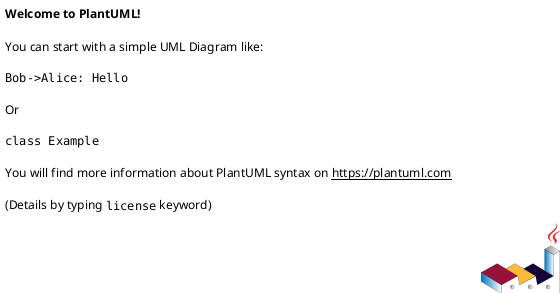

# Task: Component Architecture Design

You should act as software architect. 
Using the following template, define architecture design for component currently on the screen.
You must take to account the Software Structure and General Architecture Decisions

Component Architecture design template:

## Component name
Short component description
### Architecture
### Design Principles
### Class Diagram

### API Description
