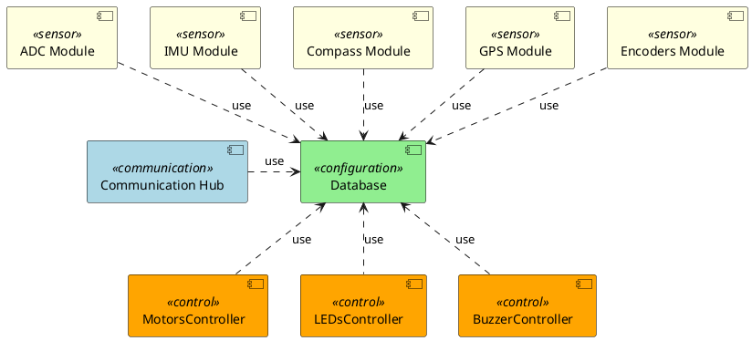

# Software Architecture Design - Chassis Controller (STM32)

## Software Structure

- **Database**: Central configuration and state store used by all components to read settings and publish state/telemetry.
- **Communication Hub**: Manages external communication interfaces.
- **MotorsController**: Control motors speed.
- **ADC Module**: Samples analog channels (battery, sensors) and writes measured values to the Database.
- **IMU Module**: Provides accelerometer and gyroscope data.
- **Compass Module**: Provides heading information and writes orientation data.
- **GPS Module**: Provide GPS data.
- **Encoders Module**: Reads wheel encoder counts, calculate speed.
- **LEDsController**: Controls visual indicators (LEDs).
- **BuzzerController**: Controls audible alerts.

## General Architecture Decisions

### SAD-D-1: Avoid direct communication between modules.
Communication between modules should be done using the Database to avoid tight coupling and hidden dependencies.

**Rules:**
- Modules MUST NOT call each other's internal APIs or share memory for coordination.
- All inter-module signals, commands and state MUST be published to and consumed from the Database using defined keys/topics and formats.

**Exceptions:**
- A limited, documented exception exists for hard real-time control loops where Database-mediated communication cannot meet latency or jitter requirements; such cases require architectural approval and clear justification.

### SAD-D-2: Use common module template for Sensors and Controls
Separate low-level device handling (Driver) from project integration (Utility) to maximise reuse and testability.

**Rules:**
- Each module should consist of two parts:
  - Driver: Code that directly interacts with hardware, samples inputs, performs filtering and basic signal processing. Drivers MUST be OS-agnostic (no RTOS APIs).
  - Utility: Code that integrates the driver with this project: reads configuration from the Database, implements task/thread behaviour, handles scheduling, and calls Driver APIs. Utilities MAY use FreeRTOS and other OS services.
- Each component resides in its own folder.
- Each component MUST provide at least:
  - drv\<Name\>.h
  - drv\<Name\>.c
  - ul\<Name\>.h
  - ul\<Name\>.c

where <Name> is the component short name (e.g. drvImu.c / ulImu.c)

**Exceptions:**
- Any exception (e.g. extreme real-time constraints) requires architectural justification and explicit approval.

### SAD-D-3: The states of driver must be determinated
Each driver MUST be implemented as a state machine to handle its operational states in a deterministic manner. The switch-case (switch-programming) state machine approach SHOULD be used for clarity and maintainability.

**Rules:**
- Drivers MUST define all possible operational states explicitly (e.g. INIT, READY, ERROR, RUNNING, STOPPED).
- State transitions MUST be handled using a switch-case structure or equivalent, with clear entry and exit conditions for each state.
- Drivers MUST NOT perform actions outside their defined state transitions.
- State variables MUST be private to the driver and not exposed to other modules.
- Each driver MUST have a public function `run()` that should be called periodically and used as the clock for the state machine.
- If a driver requires a delay in its logic, it MUST be implemented as a separate state, and the driver MUST measure the time elapsed since entering that state.

**Exceptions:**
- Exceptions to the state machine approach (e.g. for extremely simple drivers or hardware with stateless operation) require architectural approval and explicit justification.

## Database

## Communication Hub

## MotorsController

## ADC Module

## IMU Module

## Compass Module

## GPS Module

## Encoders Module

## LEDsController

## BuzzerController

