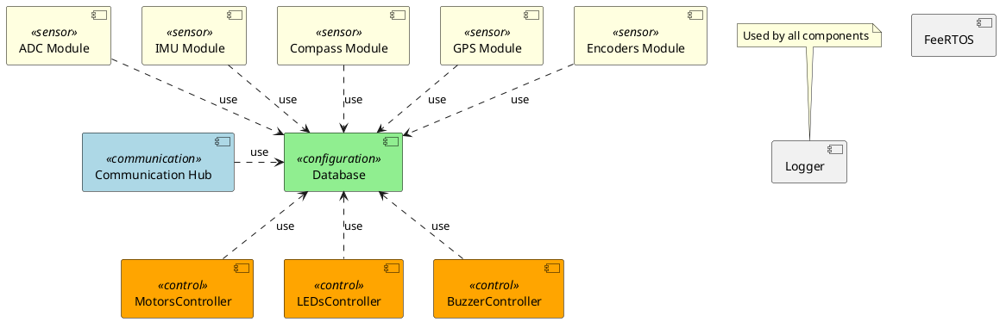
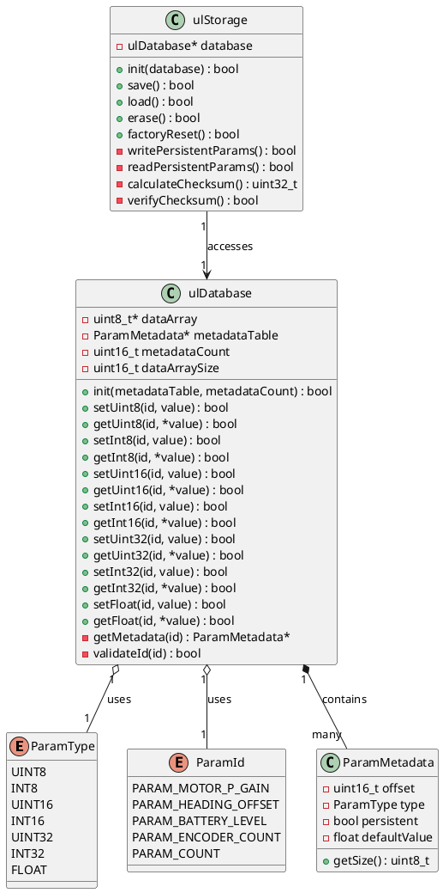

# Software Architecture Design - Chassis Controller (STM32)
<!-- The markdown-toc utilitity is used to generate the Table of Contents -->
<!-- Installation: npm install -g markdown-toc -->
<!-- Usage: markdown-toc -i README.md -->
<!-- toc -->

- [Software Structure](#software-structure)
- [General Architecture Decisions](#general-architecture-decisions)
  * [SAD-D-1: Avoid direct communication between modules.](#sad-d-1-avoid-direct-communication-between-modules)
  * [SAD-D-2: Use common module template for Sensors and Controls](#sad-d-2-use-common-module-template-for-sensors-and-controls)
  * [SAD-D-3: The states of driver must be determinated](#sad-d-3-the-states-of-driver-must-be-determinated)
- [Database](#database)
  * [Architecture](#architecture)
  * [Design Principles](#design-principles)
  * [Class Diagram](#class-diagram)
  * [API Description](#api-description)
  * [Usage Example](#usage-example)
- [Communication Hub](#communication-hub)
- [MotorsController](#motorscontroller)
- [ADC Module](#adc-module)
- [IMU Module](#imu-module)
- [Compass Module](#compass-module)
- [GPS Module](#gps-module)
- [Encoders Module](#encoders-module)
- [LEDsController](#ledscontroller)
- [BuzzerController](#buzzercontroller)
- [Logger](#logger)

<!-- tocstop -->

**How to View PlantUML Diagrams**

To view PlantUML diagrams in this document:

1. Install **Visual Studio Code** with the **PlantUML** extension from: [https://marketplace.visualstudio.com/items?itemName=jebbs.plantuml](https://marketplace.visualstudio.com/items?itemName=jebbs.plantuml)
2. Configure the extension to use the PlantUML online render server:
   - Open VS Code settings (File → Preferences → Settings)
   - Search for "PlantUML: Server"
   - Set the server URL to: `https://www.plantuml.com/plantuml`
3. Open this Markdown file in VS Code.
4. Use the Markdown preview feature to view rendered diagrams (Ctrl+Shift+V or right-click → "Open Preview").

Alternatively, you can use the online PlantUML editor at [https://www.plantuml.com/plantuml](https://www.plantuml.com/plantuml) by copying the diagram code.

## Software Structure



- **Database**: Central configuration and state store used by all components to read settings and publish state/telemetry.
- **Communication Hub**: Manages external communication interfaces.
- **MotorsController**: Control motors speed.
- **ADC Module**: Samples analog channels (battery, sensors) and writes measured values to the Database.
- **IMU Module**: Provides accelerometer and gyroscope data.
- **Compass Module**: Provides heading information and writes orientation data.
- **GPS Module**: Provide GPS data.
- **Encoders Module**: Reads wheel encoder counts, calculate speed.
- **LEDsController**: Controls visual indicators (LEDs).
- **BuzzerController**: Controls audible alerts.
- **Logger**: Provides logging output for all components.

## General Architecture Decisions

### SAD-D-1: Avoid direct communication between modules.
Communication between modules should be done using the Database to avoid tight coupling and hidden dependencies.

**Rules:**
- Modules MUST NOT call each other's internal APIs or share memory for coordination.
- All inter-module signals, commands and state MUST be published to and consumed from the Database using defined keys/topics and formats.

**Exceptions:**
- A limited, documented exception exists for hard real-time control loops where Database-mediated communication cannot meet latency or jitter requirements; such cases require architectural approval and clear justification.

### SAD-D-2: Use common module template for Sensors and Controls
Separate low-level device handling (Driver) from project integration (Utility) to maximise reuse and testability.

**Rules:**
- Each module should consist of two parts:
  - Driver: Code that directly interacts with hardware, samples inputs, performs filtering and basic signal processing. Drivers MUST be OS-agnostic (no RTOS APIs).
  - Utility: Code that integrates the driver with this project: reads configuration from the Database, implements task/thread behaviour, handles scheduling, and calls Driver APIs. Utilities MAY use FreeRTOS and other OS services.
- Each component resides in its own folder.
- Each component MUST provide at least:
  - drv\<Name\>.h
  - drv\<Name\>.c
  - ul\<Name\>.h
  - ul\<Name\>.c

where <Name> is the component short name (e.g. drvImu.c / ulImu.c)

**Exceptions:**
- Any exception (e.g. extreme real-time constraints) requires architectural justification and explicit approval.

### SAD-D-3: The states of driver must be determinated
Each driver MUST be implemented as a state machine to handle its operational states in a deterministic manner. The switch-case (switch-programming) state machine approach SHOULD be used for clarity and maintainability.

**Rules:**
- Drivers MUST define all possible operational states explicitly (e.g. INIT, READY, ERROR, RUNNING, STOPPED).
- State transitions MUST be handled using a switch-case structure or equivalent, with clear entry and exit conditions for each state.
- Drivers MUST NOT perform actions outside their defined state transitions.
- State variables MUST be private to the driver and not exposed to other modules.
- Each driver MUST have a public function `run()` that should be called periodically and used as the clock for the state machine.
- If a driver requires a delay in its logic, it MUST be implemented as a separate state, and the driver MUST measure the time elapsed since entering that state.

**Exceptions:**
- Exceptions to the state machine approach (e.g. for extremely simple drivers or hardware with stateless operation) require architectural approval and explicit justification.

## Database
This is the central configuration and state store used by all components to read settings and publish state/telemetry.

The Database component provides a lightweight, type-safe parameter management system with persistent storage capabilities. It uses a metadata-driven approach where parameters are stored sequentially in a byte array, with their layout defined by a metadata table.

### Architecture

The Database component consists of two main parts:

1. **ulDatabase**: Manages parameters in RAM, provides type-safe API for reading and writing parameters using unique IDs.
2. **ulStorage**: Handles serialization and persistence of parameters marked as persistent to non-volatile memory (e.g., Flash, EEPROM).

### Design Principles

- **Metadata-driven layout**: Parameter positions in the data array are computed from metadata (offset and type), allowing flexible schema definition.
- **Type safety**: Separate getter/setter functions per data type prevent type mismatches.
- **Selective persistence**: Only parameters marked with the `persistent` flag are saved to non-volatile storage.
- **Compact storage**: Parameters are stored sequentially in a byte array to minimize RAM footprint.
- **Persistent parameters ordering**: All persistent parameters MUST be placed at the beginning of the metadata table. This allows efficient storage operations by treating persistent data as a contiguous block.
- **Default values**: Each parameter has a default value stored in metadata as a float, which is type-cast during initialization or reset operations.

### Class Diagram



### API Description

#### ulDatabase

**Public Methods:**
- `init(metadataTable, metadataCount)`: Initializes the database with a metadata table defining all parameters. Calculates required data array size and allocates memory. Sets all parameters to their default values.
- `setUint8/Int8/Uint16/Int16/Uint32/Int32/Float(id, value)`: Type-specific setters. Each validates the ID, checks type compatibility, and writes the value at the computed offset.
- `getUint8/Int8/Uint16/Int16/Uint32/Int32/Float(id, *value)`: Type-specific getters. Each validates the ID, checks type compatibility, and reads the value from the computed offset.
- `reset(id)`: Resets a parameter to its default value from metadata.
- `resetAll()`: Resets all parameters to their default values.


#### ulStorage

**Public Methods:**
- `init(database)`: Initializes the storage module with a reference to the ulDatabase instance.
- `save()`: Writes all parameters marked as `persistent` to non-volatile memory along with a checksum.
- `load()`: Reads persistent parameters from non-volatile memory, verifies checksum, and updates the ulDatabase.
- `erase()`: Erases persistent storage (factory reset).
- `factoryReset()`: Erases persistent storage and resets all parameters to default values.

**Private Methods:**
- `writePersistentParams()`: Internal method to serialize and write persistent parameters.
- `readPersistentParams()`: Internal method to read and deserialize persistent parameters.
- `calculateChecksum()`: Computes CRC32 or similar checksum over persistent data.
- `verifyChecksum()`: Validates data integrity after reading from storage.

### Usage Example

```c
// Define parameter IDs as enum
typedef enum {
    // Persistent parameters MUST be first
    PARAM_MOTOR_P_GAIN = 0,
    PARAM_HEADING_OFFSET,
    // Non-persistent parameters after
    PARAM_BATTERY_LEVEL,
    PARAM_ENCODER_COUNT,
    PARAM_COUNT  // Total number of parameters
} ParamId;

// Define metadata table (persistent parameters at the beginning)
ParamMetadata metadata[] = {
    {.offset = 0,  .type = FLOAT,  .persistent = true,  .defaultValue = 1.5f},  // PARAM_MOTOR_P_GAIN
    {.offset = 4,  .type = INT16,  .persistent = true,  .defaultValue = 0.0f},  // PARAM_HEADING_OFFSET
    {.offset = 6,  .type = UINT8,  .persistent = false, .defaultValue = 0.0f},  // PARAM_BATTERY_LEVEL
    {.offset = 7,  .type = UINT32, .persistent = false, .defaultValue = 0.0f},  // PARAM_ENCODER_COUNT
};

// Initialize (sets all parameters to default values)
ulDatabase_init(metadata, PARAM_COUNT);
ulStorage_init(&database);

// Load persisted values (overrides defaults for persistent params)
ulStorage_load();

// Read/Write parameters using enum
uint8_t battLevel;
ulDatabase_getUint8(PARAM_BATTERY_LEVEL, &battLevel);

float pGain = 1.5f;
ulDatabase_setFloat(PARAM_MOTOR_P_GAIN, pGain);

// Reset single parameter to default
ulDatabase_reset(PARAM_MOTOR_P_GAIN);

// Factory reset: erase storage and reset all to defaults
ulStorage_factoryReset();

// Save persistent parameters
ulStorage_save();
```

## Communication Hub

## MotorsController

## ADC Module

## IMU Module

## Compass Module

## GPS Module

## Encoders Module

## LEDsController

## BuzzerController

## Logger

